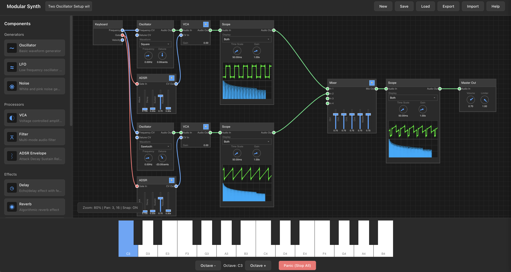

# Modular Synthesizer

A browser-based modular synthesizer application built with TypeScript and the Web Audio API. Create complex sound synthesis patches by connecting virtual modules in a visual canvas environment.

This is an experiment to see how far we can get with the Web Audio API, as well as a test on how good AI assisted coding works.

The first version of this project was built in October 2025 by an experienced developer using only AI prompts in [Claude Code](https://claude.ai)/Sonnet 4.5 with the assistance of [GitHub Spec-Kit](https://github.com/github/spec-kit), no code has been written "by hand". Total development time was about 60-70 hours.

It is currently in ongoing development. New features and optimizations are implemented once in a while.



## Features

### Core Components

#### Generators
- **Oscillator**: Programmable waveform generator (sine, square, sawtooth, triangle) with frequency and detune controls
- **LFO (Low Frequency Oscillator)**: Modulation source for creating time-varying effects. Supports a runtime on/off toggle — the oscillator keeps running internally so phase is maintained when re-enabled. Toggle state is persisted with the patch.
- **Noise Generator**: White noise source for percussion and texture

#### Processors
- **Filter**: Multi-mode filter (lowpass, highpass, bandpass, notch) with cutoff and resonance controls
- **VCA (Voltage Controlled Amplifier)**: Gain control module for shaping amplitude

#### Envelopes
- **ADSR Envelope**: Attack, Decay, Sustain, Release envelope generator for shaping sound over time
- **Filter Envelope**: Dedicated envelope for filter modulation

#### Effects
- **Delay**: Echo/delay effect with time and feedback controls
- **Reverb**: Room simulation for spatial effects
- **Distortion**: Waveshaping distortion for harmonically rich sounds
- **Chorus**: Modulation effect for thickening sounds
- **Effect Bypass**: All effect components support a runtime bypass toggle — click to pass audio through unmodified. Bypass state is persisted with the patch.

#### Utilities
- **Mixer**: Combine multiple audio signals
- **Keyboard Input**: Virtual keyboard for note input with CV (Control Voltage) outputs
- **Master Output**: Final output stage with volume and limiter controls
- **Step Sequencer**: 16-step melodic sequencer with per-step note, velocity, and gate length controls. Supports standalone sequencing and arpeggiator mode (driven by external keyboard input). Features a canvas-native note picker popup, tied gate support, and configurable BPM and pattern length.
- **Chord Finder**: Chord reference and progression generator. Displays all diatonic chords for a selected key in a circular layout, generates musically coherent chord progressions, and outputs chord notes as CV signals (Hz) for direct connection to oscillators.
- **Collider**: Physics-based CV/Gate generator. Simulates bouncing balls on a 2D canvas — each collision triggers a gate and emits a CV note from a selected musical scale. Configurable ball count, speed presets, BPM, gate size, and scale (Major, Harmonic Minor, Natural Minor, Lydian, Mixolydian).

#### Analyzers
- **Oscilloscope**: Real-time audio visualization with three display modes:
  - Waveform view (time-domain)
  - Spectrum view (frequency-domain)
  - Split view (both waveform and spectrum)
  - Rendered directly on the main canvas for pixel-crisp output at all zoom levels and high-DPI displays

### Canvas Features

- **Visual Patching**: Drag and drop components onto the canvas
- **Connection System**: Click and drag from output ports to input ports to create signal paths
- **Zoom & Pan**: Mouse wheel to zoom, click and drag empty space to pan
- **Grid Snapping**: Toggle grid snapping with the backtick key (\`)
- **Multi-Select**: Ctrl/Cmd + click to select multiple components
- **Delete**: Select components and press Delete or Backspace to remove them

### Signal Types

The synthesizer uses three types of signals, color-coded for easy identification:

- **Audio** (Blue): Full-bandwidth audio signals
- **CV (Control Voltage)** (Green): Control signals for modulation (e.g., frequency, filter cutoff)
- **Gate** (Red): Trigger signals for envelopes and timing

## Getting Started

### Prerequisites

- Node.js (v16 or higher)
- npm or yarn

### Installation

```bash
# Clone the repository
git clone https://github.com/michael-graute/modular-web-syntheziser.git
cd modular-web-synthesizer

# Install dependencies
npm install

# Start development server
npm run dev

# Build for production
npm run build
```

### Development

```bash
# Run TypeScript compiler in watch mode
npm run dev

# Build the project
npm run build

# Preview production build
npm run preview
```

## Usage

### Loading a Factory Patch

1. Click on "Load" in the Top Menu, then select "Factory"
2. Load a Factory Preset by clicking on it

### Creating a Basic Patch

1. **Add Components**: Drag components from the left sidebar onto the canvas
2. **Make Connections**: Click an output port (right side) and drag to an input port (left side)
3. **Adjust Parameters**: Use knobs, sliders, and dropdowns to control component parameters
4. **Play Notes**: Use the virtual keyboard at the bottom to trigger notes

### Example: Simple Synthesizer Voice

1. Add a **Keyboard Input** component
2. Add an **Oscillator** component
3. Add an **ADSR Envelope** component
4. Add a **VCA** component
5. Add a **Master Output** component
6. Connect:
   - Keyboard CV Out → Oscillator Frequency CV
   - Keyboard Gate Out → ADSR Gate
   - Oscillator Audio Out → VCA Audio In
   - ADSR Out → VCA CV
   - VCA Out → Master Output In
7. Play notes on the keyboard to hear the synthesizer

### Example: Oscilloscope Analysis

1. Add an **Oscilloscope** component
2. Place it between any audio output and input (e.g., between Oscillator and Filter)
3. Use the dropdown to select display mode
4. Adjust time scale and gain knobs to optimize the display
5. The oscilloscope passes audio through without modification

### Example: Step Sequencer Melody

1. Add a **Step Sequencer** component
2. Add an **Oscillator**, **ADSR Envelope**, **VCA**, and **Master Output**
3. Connect:
   - Step Sequencer Frequency Out → Oscillator Frequency CV
   - Step Sequencer Gate Out → ADSR Gate
   - Oscillator Audio Out → VCA Audio In
   - ADSR Out → VCA CV
   - VCA Out → Master Output In
4. Click note labels in each step cell to set pitches via the canvas popup
5. Adjust velocity knobs and gate length dropdowns per step
6. Press Play — the sequencer loops through active steps at the configured BPM

### Example: Chord Finder with Oscillators

1. Add a **Chord Finder** component
2. Set the musical key and click "Generate Progression" to create a chord sequence
3. Connect the Chord Finder CV outputs to three **Oscillator** frequency inputs
4. Click any chord node in the circle — the oscillators play the corresponding chord
5. Hold a chord node to sustain; release to stop

### Saving and Loading Patches

- **Save**: Click the "Save" button to save the current patch to browser storage
- **Load**: Click the "Load" button to restore a previously saved patch
- **Export**: Export patch as JSON file for backup or sharing
- **Import**: Import patch from JSON file
- **New**: Clear the canvas and start a new patch

### Keyboard Shortcuts

- **\`** (backtick): Toggle grid snapping
- **~** (Shift + backtick): Toggle grid visibility
- **Delete/Backspace**: Delete selected components
- **Ctrl/Cmd + Click**: Multi-select components
- **Shift + Click** on connection: Delete connection

## Project Structure

```
src/
├── components/          # Audio component implementations
│   ├── base/           # Base component classes
│   ├── generators/     # Oscillator, LFO, Noise
│   ├── processors/     # Filter, VCA
│   ├── envelopes/      # ADSR, Filter Envelope
│   ├── effects/        # Delay, Reverb, Distortion, Chorus
│   ├── utilities/      # Mixer, Keyboard, Master Output, StepSequencer, ChordFinder, Collider
│   └── analyzers/      # Oscilloscope
├── canvas/             # Visual canvas rendering
│   ├── controls/       # Knobs, sliders, dropdowns
│   └── displays/       # Oscilloscope, ChordFinder, StepSequencer, Collider displays
├── physics/            # Physics engine for Collider (PhysicsEngine, CollisionResolver)
├── music/              # Musical utilities (MusicalScale, WeightedRandomSelector)
├── timing/             # BPM and gate duration calculations
├── core/               # Core engine and types
├── ui/                 # User interface components
├── utils/              # Utility functions and constants
└── styles/             # CSS stylesheets
```

## Technical Details

### Architecture

- **TypeScript**: Strongly-typed codebase for maintainability
- **Web Audio API**: Native browser audio synthesis and processing
- **Canvas 2D**: Hardware-accelerated graphics rendering
- **Component-Based**: Modular architecture for easy extension
- **Event-Driven**: Event bus for component communication

### Audio Engine

- Sample Rate: 48kHz (browser default)
- Audio Context: Single shared AudioContext for all components
- Connection Management: Automatic audio routing and cleanup
- Parameter Automation: Smooth parameter changes using AudioParam

### Performance

- **60 FPS** canvas rendering with requestAnimationFrame
- **Optimized** audio graph connections
- **Efficient** viewport transformations for zoom/pan
- **Real-time** oscilloscope visualization

## Browser Compatibility

- Chrome/Edge: ✅ Fully supported
- Firefox: ✅ Fully supported
- Safari: ✅ Fully supported
- Opera: ✅ Fully supported

Note: Requires a modern browser with Web Audio API support.

## Acknowledgments

Built with:
- TypeScript
- Vite
- Web Audio API
- HTML5 Canvas
- [Claude Code](https://claude.ai)
- [GitHub Spec-Kit](https://github.com/github/spec-kit)

---

**Tip**: Start with simple patches and gradually build complexity. The modular nature allows for endless creative possibilities!
